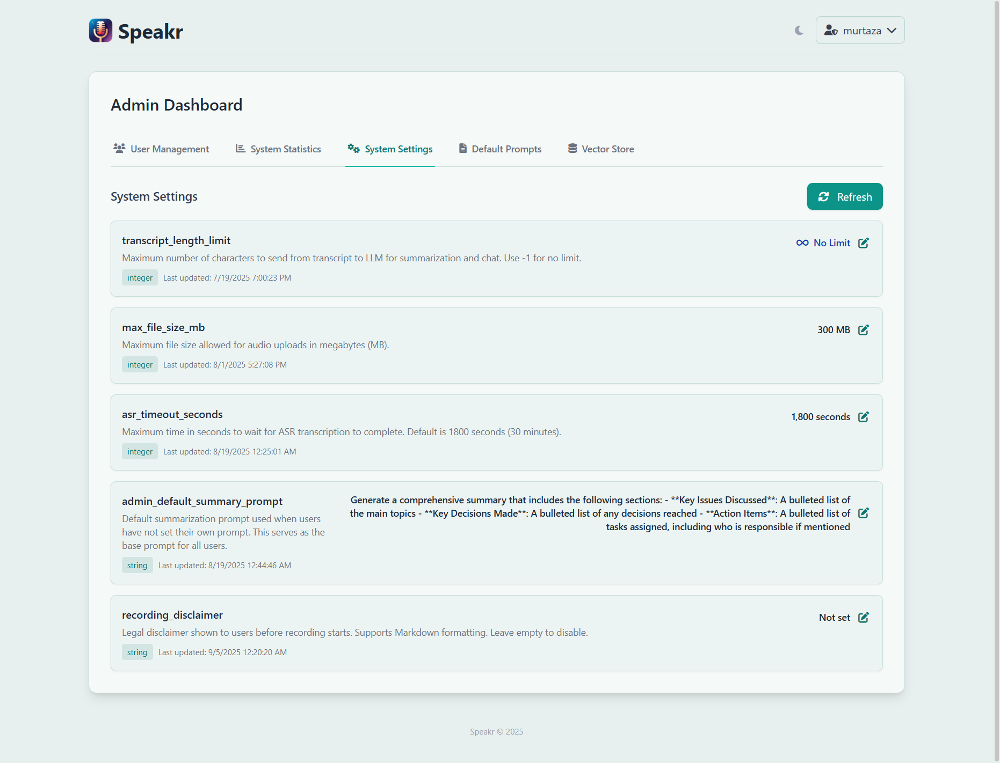

# System Settings

System Settings is where you configure the fundamental behaviors that affect every user and recording in your LecApp instance. These global parameters shape how the system operates, from technical limits to user-facing features.

## Transcript Length Limit

The transcript length limit determines how much text gets sent to the AI when generating summaries or responding to chats. This seemingly simple number has a big effect on both quality and cost.

When set to "No Limit," the entire transcript goes to the AI regardless of length. This ensures the AI has complete context but can become expensive for long recordings. A two-hour meeting might generate 20,000 words of transcript, consuming significant API tokens and potentially overwhelming the AI model's context window. This limit will also be applied to the speaker auto-detection feature in the speaker identification modal.

Setting a character limit (like 50,000 characters) creates a ceiling on API consumption. The system will truncate very long transcripts, sending only the beginning portion to the AI. This keeps costs predictable but might mean the AI misses important content from later in the recording.

The sweet spot depends on your use case. For typical meetings under an hour, 50,000 characters usually captures everything. For longer sessions, you might increase this limit or train users to split recordings. Monitor your API costs and user feedback to find the right balance.

## Maximum File Size

The file size limit protects your system from being overwhelmed by massive uploads while ensuring users can work with reasonable recordings. The default 300MB accommodates several hours of compressed audio, which covers most use cases.

Raising this limit allows longer recordings but requires careful consideration. Larger files take longer to upload, consume more storage, and might timeout during processing. Your server needs enough memory to handle these files, and your storage must accommodate them. Network timeouts, browser limitations, and user patience all factor into what's practical.

If users frequently hit the limit, consider whether they really need single recordings that long. Often, splitting long sessions into logical segments produces better results - easier to review, faster to process, and more focused summaries.

## ASR Timeout Settings

The ASR timeout determines how long LecApp will wait for advanced transcription services to complete their work. The default 1,800 seconds (30 minutes) handles most recordings, but you might need to adjust based on your transcription service and typical file sizes.

Setting this too low causes longer recordings to fail even when the transcription service is working normally. The recording appears stuck in processing, then eventually fails, frustrating users who must retry or give up. Setting it too high ties up system resources waiting for services that might have actually failed.

Your optimal timeout depends on your transcription service's performance and your users' recording lengths. Monitor processing times for successful transcriptions and set the timeout comfortably above your longest normal processing time. If you regularly process multi-hour recordings, you might need 3,600 seconds or more.

## Recording Disclaimer

The recording disclaimer appears before users start any recording session, making it perfect for legal notices, policy reminders, or usage guidelines. This markdown-formatted message ensures users understand their responsibilities before creating content.

Organizations often use this for compliance requirements - reminding users about consent requirements, data handling policies, or appropriate use guidelines. Educational institutions might note that recordings are for academic purposes only. Healthcare organizations could reference HIPAA compliance requirements.

Keep disclaimers concise and relevant. Users see this message frequently, so lengthy legal text becomes an ignored click-through. Focus on the most important points, and link to detailed policies if needed. The markdown support lets you format the message clearly with bold text for emphasis or links to additional resources.

## System-Wide Impact

Every setting on this page affects all users immediately. Changes take effect as soon as you save them, without requiring system restarts or user logouts. This immediate application means you should test changes carefully and communicate significant modifications to your users.

The refresh button reloads settings from the database, useful if multiple admins might be making changes or if you want to ensure you're seeing the latest values. The interface shows when each setting was last updated, helping you track changes over time.

## Troubleshooting Common Issues

When recordings fail consistently, check if they're hitting your configured limits. The error logs will indicate if files are too large or if processing is timing out. Users might not realize their recordings exceed limits, especially if they're uploading existing content rather than recording directly.

If API costs spike unexpectedly, review your transcript length limit. A single user uploading many long recordings could dramatically increase consumption if no limit is set. The combination of user activity and system settings determines your actual costs.

Processing backlogs might indicate your timeout is too high. If the system waits 30 minutes for each failed transcription attempt, a series of problematic files could block the queue for hours. Balance patience for slow processing with the need to fail fast when services are actually down.

---

Next: [Default Prompts](prompts.md) →